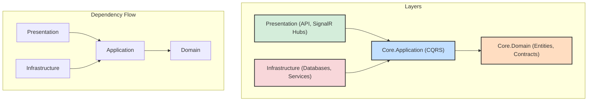
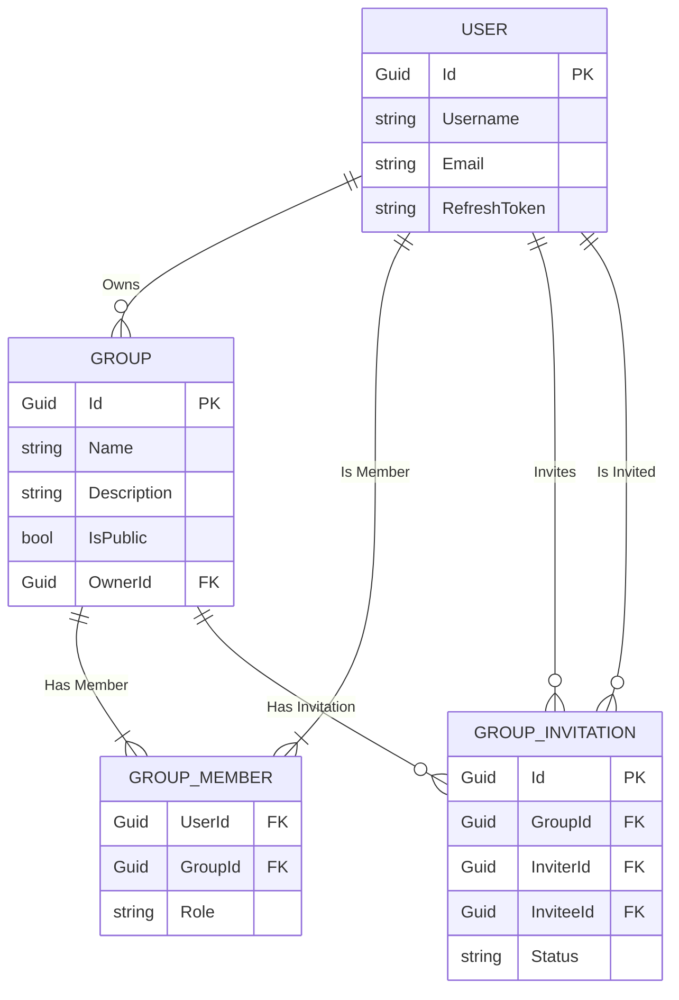
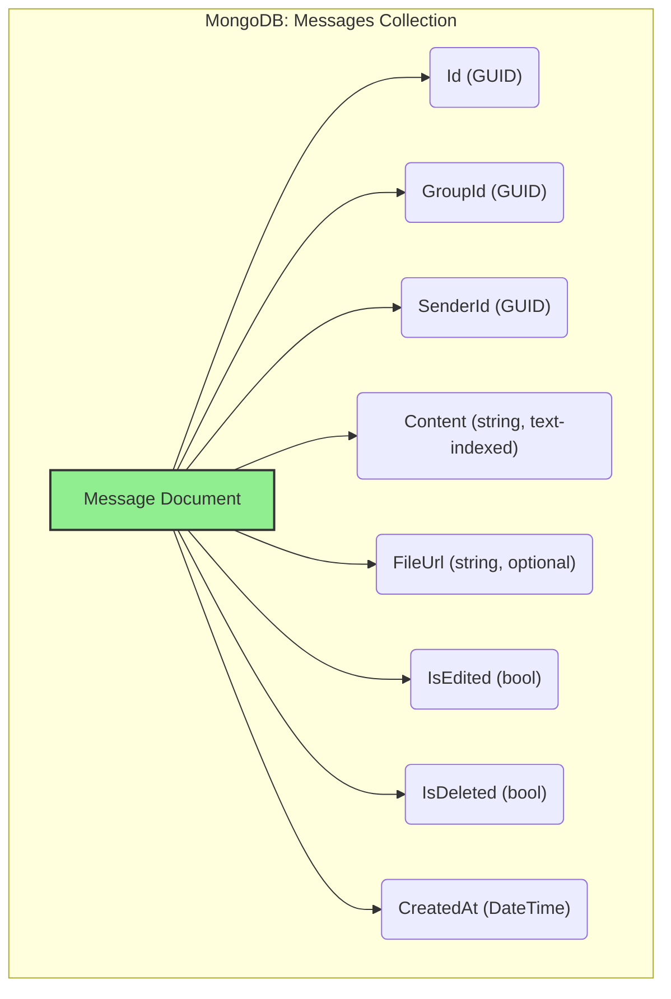

# BS - Real-Time Chat Application Backend 


This is an example project that provides a complete backend solution for a real-time chat service. It features a secure, token-based authentication system, comprehensive group management (public/private groups, invitations, roles), real-time messaging via SignalR with message editing/deleting, and a polyglot persistence layer using **PostgreSQL** and **MongoDB**.

## 🏛️ Architecture

The project is built upon **Onion Architecture** to ensure a clean, decoupled, and maintainable codebase. The core business logic is independent of external frameworks and technologies, making it highly testable and adaptable.



### Polyglot Persistence & CQRS

The application implements a **Polyglot Persistence** strategy to leverage the best database technology for each specific need:
*   **PostgreSQL:** Used for relational data that requires strong consistency, such as users, groups, and membership roles. Managed via Entity Framework Core.
*   **MongoDB:** Used for high-volume, non-relational data like chat messages, enabling fast access and powerful full-text search capabilities.

The **CQRS (Command Query Responsibility Segregation)** pattern, implemented with MediatR, separates read and write operations. This enhances performance, scalability, and maintainability by allowing read and write workloads to be optimized independently.

## 💾 Data Models

### PostgreSQL (Relational Data)
This diagram illustrates the relational schema managed by Entity Framework Core, including users, groups, and their relationships.



### MongoDB (Document Data)
The structure for `Message` documents stored in the `Messages` collection.



## ✨ Features

*   **Secure Auth:** JWT-based registration and login with Access Token rotation via Refresh Tokens.
*   **Advanced Group Management:**
    *   Create public and private groups.
    *   Join public groups directly.
    *   Full invitation system for private groups (invite, accept, decline).
    *   Role-based permissions (Owner, Admin, Member).
    *   Kick members from groups (admins only).
*   **Real-Time Messaging:**
    *   Instant messaging within groups using SignalR.
    *   Edit and soft-delete your own messages.
    *   Real-time updates broadcasted to all group members for new, edited, and deleted messages.
*   **Message Persistence & Search:**
    *   Paginated message history stored in MongoDB.
    *   Full-text search on message content within groups.
*   **Containerized & Composable:** Easy local setup and deployment with Docker and Docker Compose.
*   **Comprehensive Testing:** Includes Unit and Integration tests using xUnit.

## 📡 API Endpoints

All protected endpoints require a JWT Bearer token in the `Authorization` header.

### Authentication (`/api/auth`)
| Method | Endpoint             | Protection | Request Body                        | Description                                     |
|:-------|:---------------------|:-----------|:------------------------------------|:------------------------------------------------|
| `POST` | `/register`          | Public     | `{"username", "email", "password"}` | Registers a new user.                           |
| `POST` | `/login`             | Public     | `{"email", "password"}`             | Logs in, returning an access and refresh token. |
| `POST` | `/refresh-token`     | Public     | `{"refreshToken"}`                  | Issues a new access/refresh token pair.         |
| `POST` | `/revoke-token`      | **JWT**    | `{"refreshToken"}`                  | Revokes a user's refresh token.                 |

### Group Management (`/api/groups`)
| Method   | Endpoint                  | Protection | Request Body                          | Description                                         |
|:---------|:--------------------------|:-----------|:--------------------------------------|:----------------------------------------------------|
| `POST`   | `/`                       | **JWT**    | `{"name", "description", "isPublic"}` | Creates a new group, making the creator the Owner.  |
| `PATCH`  | `/{groupId}`              | **JWT**    | `{"name", "description", "isPublic"}` | Updates a group's details (Admin only).             |
| `POST`   | `/{groupId}/join`         | **JWT**    | -                                     | Joins a public group.                               |
| `POST`   | `/{groupId}/leave`        | **JWT**    | -                                     | Leaves a group. (Owner cannot leave).               |
| `POST`   | `/{groupId}/invite`       | **JWT**    | `{"inviteeId"}`                       | Invites a user to a private group (Admin only).     |
| `POST`   | `/{groupId}/kick`         | **JWT**    | `{"userId"}`                          | Kicks a member from a group (Admin only).           |

### Invitation Management (`/api/invitations`)
| Method | Endpoint                  | Protection | Description                                     |
|:-------|:--------------------------|:-----------|:------------------------------------------------|
| `POST` | `/{invitationId}/accept`  | **JWT**    | Accepts a pending group invitation.             |
| `POST` | `/{invitationId}/decline` | **JWT**    | Declines a pending group invitation.            |

### Messaging (`/api/messages`)
| Method   | Endpoint                       | Protection | Request Body / Query Params           | Description                                    |
|:---------|:-------------------------------|:-----------|:--------------------------------------|:-----------------------------------------------|
| `GET`    | `/group/{groupId}`             | **JWT**    | `?pageNumber=1&pageSize=50`           | Retrieves paginated messages from a group.     |
| `GET`    | `/group/{groupId}/search`      | **JWT**    | `?searchText=term`                    | Performs full-text search on group messages.   |
| `POST`   | `/`                            | **JWT**    | `{"groupId", "content", "fileUrl"}`   | Sends a message to a group.                    |
| `PUT`    | `/{messageId}`                 | **JWT**    | `{"newContent": "..."}`               | Edits the content of a message you sent.       |
| `DELETE` | `/{messageId}`                 | **JWT**    | -                                     | Soft-deletes a message you sent.               |

## 🛠️ Tech Stack

*   **Framework:** ASP.NET Core 9
*   **Databases:** PostgreSQL, MongoDB
*   **Real-Time:** SignalR
*   **Architecture:** Onion, CQRS, Repository Pattern
*   **Authentication:** JWT (JSON Web Tokens)
*   **ORM:** Entity Framework Core
*   **Testing:** xUnit, Moq, FluentAssertions
*   **Containerization:** Docker, Docker Compose

## 🔄 CI/CD Overview

This project is equipped with a CI/CD pipeline using **GitHub Actions** (`.github/workflows/build-and-test.yml`). The pipeline automates the build, test, and containerization process to ensure code quality and streamline deployment.

The pipeline is triggered on every `push` and `pull_request` to the `main` branch and consists of three sequential jobs:

1.  **`build`:**
    *   Checks out the source code.
    *   Sets up the specified .NET environment.
    *   Restores all project dependencies (`dotnet restore`).
    *   Builds the entire solution in `Release` mode (`dotnet build`).

2.  **`test`:**
    *   Depends on the successful completion of the `build` job.
    *   Runs all unit and integration tests found in the solution (`dotnet test`). This step ensures that new changes do not break existing functionality.

3.  **`build-and-push-docker`:**
    *   Depends on the successful completion of the `test` job.
    *   Logs into Docker Hub using credentials stored in GitHub Secrets (`DOCKERHUB_USERNAME`, `DOCKERHUB_TOKEN`).
    *   Builds the application's Docker image using the provided `Dockerfile`.
    *   Pushes the newly built image to Docker Hub, tagging it for release (e.g., `your-username/bluesense-backend:latest`).

This automated workflow ensures that every change is validated and a deployable artifact (the Docker image) is produced, paving the way for Continuous Deployment.

## 🚀 Getting Started

### Prerequisites

*   [Docker Desktop](https://www.docker.com/products/docker-desktop/)
*   [.NET 9 SDK](https://dotnet.microsoft.com/download/dotnet/9.0) (for local development or running EF migrations)

### Installation & Launch

1.  **Clone the Repository:**
    ```bash
    git clone https://github.com/emreveaydin/bluesense-backend-project.git
    cd bluesense-backend-project
    ```

2.  **Run with Docker Compose:**
    From the project root, this command will build and start the API, PostgreSQL, and MongoDB containers.
    ```bash
    docker-compose up --build
    ```
    The API will be available at `https://localhost:7003` and PostgreSQL at `localhost:5433`.

3.  **Apply Database Migrations (First Run):**
    Once the containers are running, open a new terminal and run this command to create the schema in the PostgreSQL database.
    ```bash
    dotnet ef database update --project src/Infrastructure/Infrastructure.csproj -s src/Presentation/API/API.csproj
    ```

You're all set! Navigate to `https://localhost:7003/swagger` to explore and interact with the API endpoints.

## 🧪 Running Tests

To run all unit and integration tests, use the following command from the root directory:
```bash
dotnet test
```

## ⚖️ Assumptions and Tradeoffs

This project was developed with specific architectural decisions and assumptions to meet both the explicit requirements and long-term maintainability goals.

1.  **CQRS with MediatR:**
    *   **Decision:** While not explicitly required, the project implements the Command and Query Responsibility Segregation (CQRS) pattern using the MediatR library. Each API request is mapped to a single, focused Command or Query handler.
    *   **Tradeoff:** This introduces a slightly higher number of classes compared to a traditional service layer, but it offers significant benefits in return: high cohesion, low coupling, improved testability, and a clear separation of concerns that scales exceptionally well.

2.  **Polyglot Persistence:**
    *   **Decision:** The system leverages two different database technologies. PostgreSQL is used for structured, relational data like users and groups, ensuring data integrity and transactional consistency. MongoDB is designated for high-volume, semi-structured data like chat messages, optimizing for fast write/read operations and flexible search capabilities.
    *   **Tradeoff:** This approach adds a layer of complexity in managing two separate data sources but is a strategic choice for performance and scalability in a real-world chat application.

3.  **Local File Storage:**
    *   **Decision:** For the scope of this assignment, file uploads are handled by saving files to the local disk via a generic `IStorageService` interface.
    *   **Tradeoff:** This is simple and effective for a development environment. For a production deployment, this interface would be implemented with a cloud-based provider (e.g., AWS S3, Azure Blob Storage) to ensure scalability, durability, and availability without changing any application-layer code.

4.  **Global Exception Handling:**
    *   **Decision:** The project relies on the default exception handling provided by ASP.NET Core for development clarity.
    *   **Tradeoff:** A production-ready application would include a custom global exception handling middleware. This would standardize error responses into a consistent format, prevent stack traces from leaking, and integrate with a structured logging provider for better observability.

5.  **Configuration Validation:**
    *   **Decision:** Configuration is loaded using the standard `IOptions` pattern. There is no explicit validation at startup.
    *   **Tradeoff:** In a production environment, we would add validation logic (e.g., using DataAnnotations or the `IValidateOptions` interface) to the configuration models (`JwtSettings`, `MongoDbSettings`). This "fail-fast" approach ensures that the application will not start with invalid or missing configuration, preventing potential runtime errors.

6.  **Rate Limiting:**
    *   **Decision:** The API does not currently implement rate limiting.
    *   **Tradeoff:** For a production system, implementing a rate limiting strategy (e.g., using a fixed-window or sliding-window algorithm) would be essential to protect the service from abuse, prevent resource exhaustion, and ensure fair usage for all clients.

7.  **Distributed Caching:**
    *   **Decision:** Caching is not used in this implementation to keep the architecture straightforward.
    *   **Tradeoff:** A high-traffic production environment would greatly benefit from a distributed cache like Redis. Caching frequently accessed, rarely changing data (e.g., user profiles, group details) would significantly reduce database latency and load.

8. **Asynchronous Background Jobs:**
    *   **Decision:** All operations are currently handled synchronously within the API request cycle.
    *   **Tradeoff:** For potentially long-running tasks (e.g., processing large file uploads, sending email/push notifications), a background job processing system like **Hangfire** or a message queue (**RabbitMQ**) would be used. This would improve API responsiveness by offloading work from the main thread and increase system resilience.

9. **Integration Test Database Strategy:**
    *   **Decision:** Integration tests are configured to use an in-memory database provider for speed and isolation.
    *   **Tradeoff:** While fast, the in-memory provider does not perfectly replicate all behaviors of PostgreSQL (e.g., certain SQL functions, transaction isolation levels). For higher-fidelity testing, an alternative strategy using **Testcontainers** to spin up a real PostgreSQL instance in a Docker container for the duration of the test run would be a superior, albeit slower, approach.
